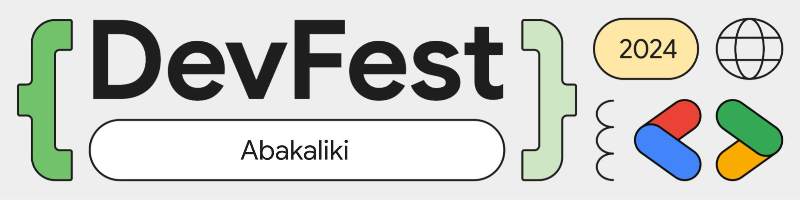

# DevFest Abakaliki 2024

DevFest is a global, decentralized tech conference hosted by the [Google Developer Groups (GDG)](https://goo.gle/gdg) community. Know more about DevFest at https://goo.gle/devfest.

## About

This repo contains the code for the custom website(s) for [GDG Abakaliki](https://gdg.community.dev/gdg-abakaliki)'s DevFest 2024.

The code for [devfestabakaliki.com](https://devfestabakaliki.com)'s website is in the [main](./main) directory. It is a React + TypeScript + Vite frontend that was built with the [2024 DevFest Brand Guidelines](https://goo.gle/devfest24-brand-guide). In addition to the beautiful UI and advert for DevFest Abakaliki 2024, this website also allows anyone to register. During the registration, attendees will have to pay for their ticket through Paystack.

We currently have 2 ticket categories:

1. Premium: Event Access for ₦3,000
2. Luxury: Event and Swag Access for ₦10,000

## Admin

The [admin](./admin) directory also contains a React + TypeScript + Vite frontend for select persons who can add attendees. The idea is if people were registered by paying via other means (cash or bank transfers), the admin can enter their details to complete their registration. In this admin site, there is also a table display of all registered attendees.

## Firebase

This entire project is built on Firebase. Firebase Hosting is used to deploy the above 2 frontends. Attendees' data are stored in Cloud Firestore. Firebase AppCheck is used to ensure that only people from the websites can access the project's resources. Cloud Functions is used for the whole project's backend.

The [functions](./functions) directory hosts TypeScript backend code that are shared across the main and admin frontends. It includes [`onCall`](https://firebase.google.com/docs/functions/callable) and [`onRequest`](https://firebase.google.com/docs/functions/http-events) cloud functions that help with managing admins, attendees, and payments. On successful registration, attendees also receive ticket confirmation emails, thanks to Cloud Functions and [Google App Script](https://developers.google.com/apps-script).
